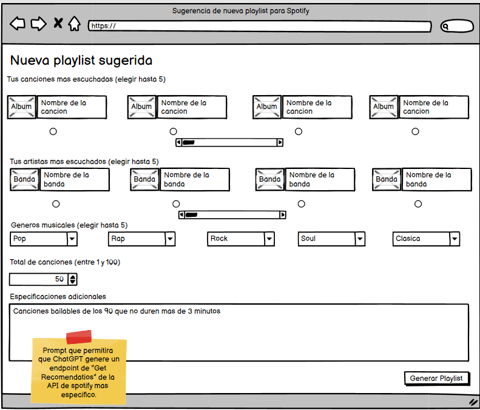

# Historia: Acceso a recomendaciones personalizadas.

- Yo como: Usuario de Spotify
- Quiero: Acceder a la aplicación y obtener recomendaciones personalizadas basadas en mis gustos musicales.
- Para: Descubrir nueva música y crear playlists que reflejen mis preferencias.

## Especificación de requerimientos.

1. La aplicación debe utilizar la autenticación OAuth de Spotify para acceder a los datos del usuario.
2. Debe presentarse una interfaz intuitiva que guíe al usuario a través del proceso de obtención de recomendaciones.
3. Las recomendaciones deben poder generarse a partir de los artistas más escuchados del usuario y/o pistas guardadas.
4. Se debe permitir que el usuario seleccione como maximo 5 de sus bandas y/o canciones favoritas, y que el total de canciones en la playlist a generar este en el intervalo de 1-100.
5. Si el usuario selecciona al menos un artista para, puede generar su playlist sin seleccionar ninguna cancion, y viceversa.
6. La aplicacion debe mostrar los generos musicales disponbles en Spotify.

## Analisis

### Pantalla de creacion de nueva subasta

A continuación se presenta la pantalla de recomendaciones, cuyo funcionamiento es:




## Criterios de aceptacion

Gherkin

### Generación de Recomendaciones
- Dado: Que el usuario ha seleccionado sus preferencias musicales
- Cuando: Solicita recomendaciones
- Entonces: La aplicación debe mostrar una playlist de canciones recomendadas basadas en sus selecciones.

## Diseño

## Pantalla de Selección de Preferencias Musicales

1. Para recuperar las canciones de preferencia del usuario:

Request:

```
GET https://api.spotify.com/v1/me/top/tracks
Accept: Application/json
Authorization: Bearer {Spotify User Token}
```
Response: Exitoso statusCode: 200
```
{
  "href": "https://api.spotify.com/v1/me/top/tracks?limit=1&offset=0",
  "limit": 1,
  "next": "https://api.spotify.com/v1/me/top/tracks?limit=1&offset=1",
  "offset": 0,
  "previous": null,
  "total": 50,
  "items": [
    {
      "album": {
        "album_type": "COMPILATION",
        "total_tracks": 20,
        "available_markets": ["AD", "AE", "AR", "AT", "AU", "BE", "BG", "BH", "BO", "BR", "CA", "CH", "CL", "CO", "CR", "CY", "CZ", "DE", "DK", "DO", "DZ", "EC", "EE", "EG", "ES", "FI", "FR", "GR", "GT", "HK", "HN", "HU", "ID", "IE", "IL", "IN", "IS", "IT", "JO", "JP", "KW", "LB", "LI", "LT", "LU", "LV", "MA", "MC", "MT", "MX", "MY", "NI", "NL", "NO", "NZ", "OM", "PA", "PE", "PH", "PL", "PS", "PT", "PY", "QA", "RO", "SA", "SE", "SG", "SK", "SV", "TH", "TN", "TR", "TW", "US", "UY", "VN", "ZA"],
        "external_urls": {
          "spotify": "https://open.spotify.com/album/1npNR6mWuE6qaqU3GGpNTB"
        },
        "href": "https://api.spotify.com/v1/albums/1npNR6mWuE6qaqU3GGpNTB",
        "id": "1npNR6mWuE6qaqU3GGpNTB",
        "images": [
          {
            "url": "https://i.scdn.co/image/ab67616d0000b2732fc8aa620527b53663388592",
            "height": 640,
            "width": 640
          },
          {
            "url": "https://i.scdn.co/image/ab67616d00001e022fc8aa620527b53663388592",
            "height": 300,
            "width": 300
          },
          {
            "url": "https://i.scdn.co/image/ab67616d000048512fc8aa620527b53663388592",
            "height": 64,
            "width": 64
          }
        ],
        "name": "All Over The World: The Very Best Of ELO",
        "release_date": "1973",
        "release_date_precision": "year",
        "type": "album",
        "uri": "spotify:album:1npNR6mWuE6qaqU3GGpNTB",
        "artists": [
          {
            "external_urls": {
              "spotify": "https://open.spotify.com/artist/7jefIIksOi1EazgRTfW2Pk"
            },
            "href": "https://api.spotify.com/v1/artists/7jefIIksOi1EazgRTfW2Pk",
            "id": "7jefIIksOi1EazgRTfW2Pk",
            "name": "Electric Light Orchestra",
            "type": "artist",
            "uri": "spotify:artist:7jefIIksOi1EazgRTfW2Pk"
          }
        ]
      },
      "artists": [
        {
          "external_urls": {
            "spotify": "https://open.spotify.com/artist/7jefIIksOi1EazgRTfW2Pk"
          },
          "href": "https://api.spotify.com/v1/artists/7jefIIksOi1EazgRTfW2Pk",
          "id": "7jefIIksOi1EazgRTfW2Pk",
          "name": "Electric Light Orchestra",
          "type": "artist",
          "uri": "spotify:artist:7jefIIksOi1EazgRTfW2Pk"
        }
      ],
      "available_markets": ["AD", "AE", "AR", "AT", "AU", "BE", "BG", "BH", "BO", "BR", "CA", "CH", "CL", "CO", "CR", "CY", "CZ", "DE", "DK", "DO", "DZ", "EC", "EE", "EG", "ES", "FI", "FR", "GR", "GT", "HK", "HN", "HU", "ID", "IE", "IL", "IN", "IS", "IT", "JO", "JP", "KW", "LB", "LI", "LT", "LU", "LV", "MA", "MC", "MT", "MX", "MY", "NI", "NL", "NO", "NZ", "OM", "PA", "PE", "PH", "PL", "PS", "PT", "PY", "QA", "RO", "SA", "SE", "SG", "SK", "SV", "TH", "TN", "TR", "TW", "US", "UY", "VN", "ZA"],
      "disc_number": 1,
      "duration_ms": 251680,
      "explicit": false,
      "external_ids": {
        "isrc": "USSM10015758"
      },
      "external_urls": {
        "spotify": "https://open.spotify.com/track/4N6HYihypXOVL24bnaR4fp"
      },
      "href": "https://api.spotify.com/v1/tracks/4N6HYihypXOVL24bnaR4fp",
      "id": "4N6HYihypXOVL24bnaR4fp",
      "name": "Evil Woman",
      "popularity": 55,
      "preview_url": "https://p.scdn.co/mp3-preview/e18c2daac69d4c89f72180b467a117cbcb6f04a2?cid=f14f7a9acd75432da91f2f7d7053e3fd",
      "track_number": 2,
      "type": "track",
      "uri": "spotify:track:4N6HYihypXOVL24bnaR4fp",
      "is_local": false
    }
  ]
}
```

Response: No encontrado o error statusCode: 404
```
{
  "error": {
    "status": 404,
    "message": "Not Found"
  }
}
```

Response: Recurso bloqueado statusCode: 401
```
{
    "error": {
        "status": 401,
        "message": "No token provided"
    }
}
```

2. Para recuperar los artistas de preferencia del usuario:

Request:

```
GET https://api.spotify.com/v1/me/top/artists
Accept: Application/json
Authorization: Bearer {Spotify User Token}
```
Response: Exitoso statusCode: 200
```
{
  "href": "https://api.spotify.com/v1/me/top/artists?limit=1&offset=0",
  "limit": 1,
  "next": "https://api.spotify.com/v1/me/top/artists?limit=1&offset=1",
  "offset": 0,
  "previous": null,
  "total": 42,
  "items": [
    {
      "external_urls": {
        "spotify": "https://open.spotify.com/artist/568ZhdwyaiCyOGJRtNYhWf"
      },
      "followers": {
        "href": null,
        "total": 0
      },
      "genres": ["album rock", "classic rock", "hard rock", "metal", "rock"],
      "href": "https://api.spotify.com/v1/artists/568ZhdwyaiCyOGJRtNYhWf",
      "id": "568ZhdwyaiCyOGJRtNYhWf",
      "images": [
        {
          "url": "https://i.scdn.co/image/ab6761610000e5eb607e7523c28dd40288a08df4",
          "height": 640,
          "width": 640
        },
        {
          "url": "https://i.scdn.co/image/ab67616100005174607e7523c28dd40288a08df4",
          "height": 320,
          "width": 320
        },
        {
          "url": "https://i.scdn.co/image/ab6761610000f178607e7523c28dd40288a08df4",
          "height": 160,
          "width": 160
        }
      ],
      "name": "Deep Purple",
      "popularity": 63,
      "type": "artist",
      "uri": "spotify:artist:568ZhdwyaiCyOGJRtNYhWf"
    }
  ]
}
```

Response: No encontrado o error statusCode: 404
```
{
  "error": {
    "status": 404,
    "message": "Not Found"
  }
}
```

Response: Recurso bloqueado o statusCode: 401
```
{
    "error": {
        "status": 401,
        "message": "No token provided"
    }
}
```