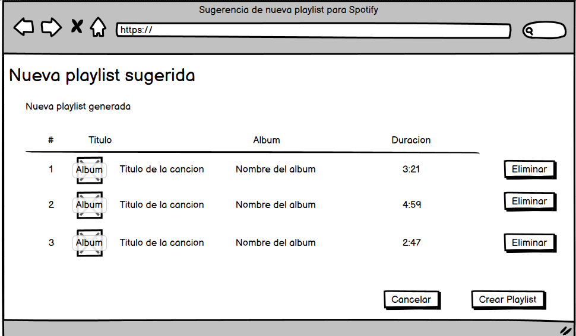

# Historia: 

- Yo como: Usuario de Spotify
- Quiero: Poder visualizar y crear una nueva playlist en mi cuenta de Spotify con las canciones recomendadas
- Para: Disfrutar de una playlist adaptada a mis gustos sin esfuerzo adicional.

## Especificación de requerimientos.

1. Debe existir una opción para guardar directamente la lista de recomendaciones como una nueva playlist en Spotify.
2. El usuario debe poder nombrar la nueva playlist y una descripcion (opcional) antes de guardarla.
3. El usuario debe tener la opcion de eliminar canciones sugeridas de la playlist antes de guardarla.
4. El usuario debe tener una vista previa de la playlist completa con todas las canciones sugeridas.

## Analisis

### Pantalla de creacion de nueva subasta

A continuación se presenta la pantalla de vista previa, cuyo funcionamiento es:



## Criterios de aceptacion

Gherkin

### Creación de Playlist

- Dado: Que el usuario desea guardar las recomendaciones en una playlist
- Cuando: Elige la opción de crear playlist y confirma su selección
- Entonces: La aplicación debe crear una nueva playlist en la cuenta de Spotify del usuario con las canciones seleccionadas.

## Diseño

## Pantalla de Selección de Preferencias Musicales

1. Para crear una nueva playlist:
Request:

```
POST https://api.spotify.com/v1/users/{user_id}/playlists
Accept: Application/json
Authorization: Bearer {Spotify User Token}
Content-Type: Application/json
```
Request Body:
```
{
    "name": "New Playlist",
    "description": "New playlist description",
    "public": false
}
```
Response: Exitoso statusCode 201
```
{
  "collaborative": false,
  "description": "string",
  "external_urls": {
    "spotify": "string"
  },
  "followers": {
    "href": "string",
    "total": 0
  },
  "href": "string",
  "id": "string",
  "images": [
    {
      "url": "https://i.scdn.co/image/ab67616d00001e02ff9ca10b55ce82ae553c8228",
      "height": 300,
      "width": 300
    }
  ],
  "name": "string",
  "owner": {
    "external_urls": {
      "spotify": "string"
    },
    "followers": {
      "href": "string",
      "total": 0
    },
    "href": "string",
    "id": "string",
    "type": "user",
    "uri": "string",
    "display_name": "string"
  },
  "public": false,
  "snapshot_id": "string",
  "tracks": {
    "href": "https://api.spotify.com/v1/me/shows?offset=0&limit=20",
    "limit": 20,
    "next": "https://api.spotify.com/v1/me/shows?offset=1&limit=1",
    "offset": 0,
    "previous": "https://api.spotify.com/v1/me/shows?offset=1&limit=1",
    "total": 4,
    "items": [
      {
        "added_at": "string",
        "added_by": {
          "external_urls": {
            "spotify": "string"
          },
          "followers": {
            "href": "string",
            "total": 0
          },
          "href": "string",
          "id": "string",
          "type": "user",
          "uri": "string"
        },
        "is_local": false,
        "track": {
          "album": {
            "album_type": "compilation",
            "total_tracks": 9,
            "available_markets": ["CA", "BR", "IT"],
            "external_urls": {
              "spotify": "string"
            },
            "href": "string",
            "id": "2up3OPMp9Tb4dAKM2erWXQ",
            "images": [
              {
                "url": "https://i.scdn.co/image/ab67616d00001e02ff9ca10b55ce82ae553c8228",
                "height": 300,
                "width": 300
              }
            ],
            "name": "string",
            "release_date": "1981-12",
            "release_date_precision": "year",
            "restrictions": {
              "reason": "market"
            },
            "type": "album",
            "uri": "spotify:album:2up3OPMp9Tb4dAKM2erWXQ",
            "artists": [
              {
                "external_urls": {
                  "spotify": "string"
                },
                "href": "string",
                "id": "string",
                "name": "string",
                "type": "artist",
                "uri": "string"
              }
            ]
          },
          "artists": [
            {
              "external_urls": {
                "spotify": "string"
              },
              "followers": {
                "href": "string",
                "total": 0
              },
              "genres": ["Prog rock", "Grunge"],
              "href": "string",
              "id": "string",
              "images": [
                {
                  "url": "https://i.scdn.co/image/ab67616d00001e02ff9ca10b55ce82ae553c8228",
                  "height": 300,
                  "width": 300
                }
              ],
              "name": "string",
              "popularity": 0,
              "type": "artist",
              "uri": "string"
            }
          ],
          "available_markets": ["string"],
          "disc_number": 0,
          "duration_ms": 0,
          "explicit": false,
          "external_ids": {
            "isrc": "string",
            "ean": "string",
            "upc": "string"
          },
          "external_urls": {
            "spotify": "string"
          },
          "href": "string",
          "id": "string",
          "is_playable": false,
          "linked_from": {
          },
          "restrictions": {
            "reason": "string"
          },
          "name": "string",
          "popularity": 0,
          "preview_url": "string",
          "track_number": 0,
          "type": "track",
          "uri": "string",
          "is_local": false
        }
      }
    ]
  },
  "type": "string",
  "uri": "string"
}
```

Response: No encontrado o error statusCode: 404
```
{
  "error": {
    "status": 404,
    "message": "Not Found"
  }
}
```

Response: Recurso bloqueado o statusCode: 401
```
{
    "error": {
        "status": 401,
        "message": "No token provided"
    }
}
```

2. Para agregar canciones a la Playlist creada

Request:
```
POST https://api.spotify.com/v1/playlists/{playlist_id}/tracks
Accept: Application/json
Authorization: Bearer {Spotify User Token}
Content-Type: Application/json
```
Request Body:
```
{
    "uris": [
        "string"
    ],
    "position": 0
}
```
Response: Exitoso statusCode 201
```
{
  "snapshot_id": "JbtmHBDBAYAMhbJxS5XX4vW0YHUMj+XXPHoF3RR3a7+m6+P+9mJzH4Fj2tZa"
}
```
Response: No encontrado o error statusCode: 404
```
{
  "error": {
    "status": 404,
    "message": "Not Found"
  }
}
```
Response: Recurso bloqueado o statusCode: 401
```
{
    "error": {
        "status": 401,
        "message": "No token provided"
    }
}
```

