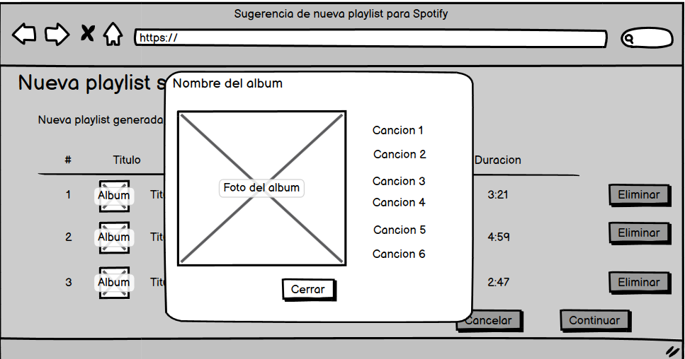

# Historia: Visualizacion de detalles de la cancion sugerida

- Yo como: Usuario de Spotify
- Quiero: Ver detalles de las canciones sugeridas en laplaylist
- Para: Tener una mejor idea sobre el trabajo de la banda que se esta sugiriendo.

## Especificación de requerimientos.

1. Se debe visualizar la imagen del album al que la cancion pertenece en dimensiones mas grandes que en la vista previa de la playlist.
2. El usuario podra ver el nombre de la banda y del album que proviene la cancion.
3. Los detalles especificados deben salir como popup al hacer click sobre una de las canciones.

## Analisis

### Pantalla de creacion de nueva subasta

A continuación se presenta la pantalla que revela los detalles de una cancion, cuyo funcionamiento es:



## Criterios de aceptacion

### Visualización de Detalles

- Dado: Que un usuario desea obtener más información sobre una canción sugerida
- Cuando: Hace clic en la canción en la lista de recomendaciones
- Entonces: La aplicación debe mostrar una ventana emergente con la imagen del álbum, el nombre de la banda o artista y una lista de otras canciones de la misma banda.

## Diseño

## Pantalla de Selección de Preferencias Musicales

1. Para obtener detalles de la cancion seleccionada 

Request:

```
GET https://api.spotify.com/v1/tracks/{id}
Accept: Application/json
Authorization: Bearer {Spotify User Token}
```

Response: Exitoso statusCode: 200

```
{  "album": {    "album_type": "compilation",    "total_tracks": 9,    "available_markets": ["CA", "BR", "IT"],    "external_urls": {      "spotify": "string"    },    "href": "string",    "id": "2up3OPMp9Tb4dAKM2erWXQ",    "images": [      {        "url": "https://i.scdn.co/image/ab67616d00001e02ff9ca10b55ce82ae553c8228",        "height": 300,        "width": 300      }    ],    "name": "string",    "release_date": "1981-12",    "release_date_precision": "year",    "restrictions": {      "reason": "market"    },    "type": "album",    "uri": "spotify:album:2up3OPMp9Tb4dAKM2erWXQ",    "artists": [      {        "external_urls": {          "spotify": "string"        },        "href": "string",        "id": "string",        "name": "string",        "type": "artist",        "uri": "string"      }    ]  },  "artists": [    {      "external_urls": {        "spotify": "string"      },      "followers": {        "href": "string",        "total": 0      },      "genres": ["Prog rock", "Grunge"],      "href": "string",      "id": "string",      "images": [        {          "url": "https://i.scdn.co/image/ab67616d00001e02ff9ca10b55ce82ae553c8228",          "height": 300,          "width": 300        }      ],      "name": "string",      "popularity": 0,      "type": "artist",      "uri": "string"    }  ],  "available_markets": ["string"],  "disc_number": 0,  "duration_ms": 0,  "explicit": false,  "external_ids": {    "isrc": "string",    "ean": "string",    "upc": "string"  },  "external_urls": {    "spotify": "string"  },  "href": "string",  "id": "string",  "is_playable": false,  "linked_from": {  },  "restrictions": {    "reason": "string"  },  "name": "string",  "popularity": 0,  "preview_url": "string",  "track_number": 0,  "type": "track",  "uri": "string",  "is_local": false}
```

Response: No encontrado o error statusCode: 404
```
{
  "error": {
    "status": 404,
    "message": "Not Found"
  }
}
```

Response: Recurso bloqueado statusCode: 401
```
{
    "error": {
        "status": 401,
        "message": "No token provided"
    }
}
```
