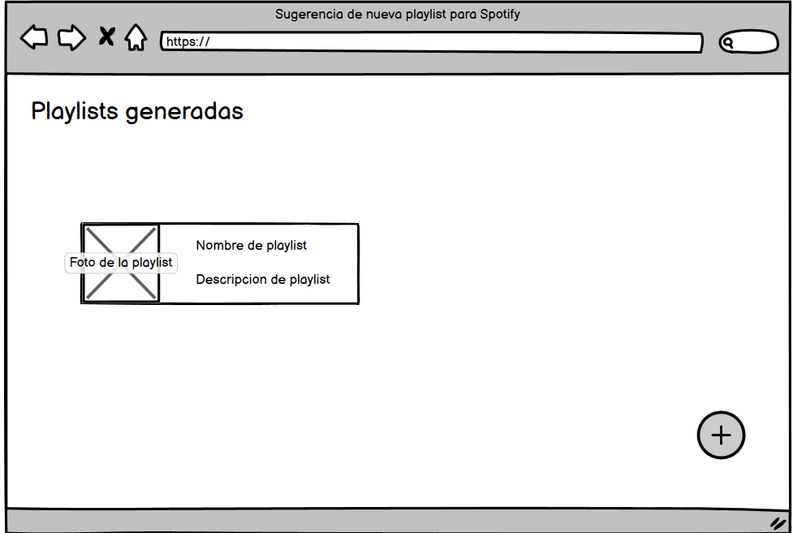

# Historia: Ver Historial de Playlists Creadas

- Yo como: Usuario registrado de la aplicación de recomendación musical
- Quiero: Acceder a mi historial de playlists creadas en la aplicación.
- Para: Poder ver un registro de todas las playlists que he generado anteriormente.

## Especificación de requerimientos.

1. La aplicación debe proporcionar una función para que los usuarios accedan a su historial de playlists creadas.
2. La información en el historial de playlists se obtendrá a través de solicitudes HTTP a la base de datos.
3. Al hacer click en cada uno de estos componentes del historial, se puede hacer una visualizacion de la playlist completa.
4. Esta pantalla debe mostrar un boton que permita al usuario crear otra playlist sugerida.

## Analisis

### Pantalla de creacion de nueva subasta



## Criterios de aceptacion

### Visualización del Historial

- Dado: Que un usuario desea ver su historial de playlists creadas
- Cuando: Selecciona la opción de historial de playlists
- Entonces: La aplicación debe mostrar una lista de todas las playlists creadas por el usuario, incluyendo detalles como el nombre de la playlist y la fecha de creación.

### Pantalla distinta si no hay historial
- Dado: Que el usuario no cuenta con un historial registrado en la aplicacion
- Cuando: Selecciona la opción de historial de playlists
- Entonces: La aplicación debe mostrar un mensaje que especifique que el usuario no tiene un historial.

## Diseño

## Pantalla de Historial

1. Para acceder al historial de playlists

```
GET BASE_URL/api/v1/user/{user_id}/playlists
Accept: Application/json
Authorization: Bearer JWT
```
Response: Exitoso statusCode: 200
```
{
  "playlists": [
    {
      "playlist_id": 101,
      "nombre": "Playlist1",
      "fecha_creacion": "2023-02-01"
    },
    {
      "playlist_id": 102,
      "nombre": "Playlist2",
      "fecha_creacion": "2023-02-03"
    }
  ]
}
```